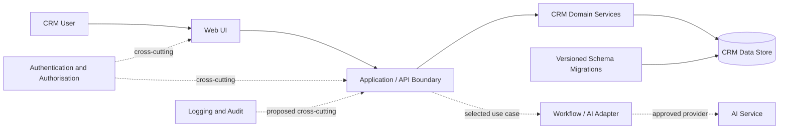

# Architecture Overview

**Status:** Draft evidence baseline — not yet verified against the starter repository  
**Last updated:** 25 August 2026

## Product boundary

The initial product is a sales-oriented CRM centred on Accounts, Contacts, Leads, Opportunities, Tasks and Events. Activity history and one controlled AI-assisted workflow are intended capabilities, but the first AI use case is still undecided.

## Current technical evidence

| Area | Current understanding | Confidence |
|---|---|---|
| Data | PostgreSQL database with Alembic schema migrations. | Reported by client; repository verification pending |
| Server | Python application; FastAPI was named. Flask was also mentioned while describing server-rendered pages, so its actual role is unresolved. | Unverified |
| UI | Server-rendered Jinja/Jinja2-style HTML; a Bootstrap version is intended to replace Salesforce-derived presentation. | Reported; public version pending |
| Client-side code | Small embedded React components perform some record lookups. | Reported; scope pending |
| API | A limited API reportedly supports Accounts, Contacts and some lookups. | Reported; endpoint inventory pending |
| Gaps | Authentication/roles and activity history are absent or incomplete; several screens are placeholders or partially implemented. | Reported; exact gaps pending |

## Target logical boundaries

The boundaries below remain valid whichever implementation option is selected.

## Architecture guardrails

- Remove Salesforce branding, copied assets and look-and-feel from delivered UI.
- Keep business rules outside templates and UI components.
- Use version-controlled schema migrations.
- Do not commit to a React or Go rewrite before the starter-code audit and vertical-slice spike.
- **Proposed until approved:** treat consequential AI output as reviewable until the Product Owner approves a narrower execution policy.

## Unresolved decisions

1. Extend the Python/server-rendered application, use React with a Python API, or rebuild the API in Go.
2. Confirm whether Flask exists in the target repository and how it relates to FastAPI.
3. Decide the activity relationship model and lead-conversion transaction.
4. Decide when authentication, roles and auditability enter the delivery plan.
5. Select the first product-facing AI workflow and its data boundary.

**Traceability:** `TR-08`, `TR-09`, `TR-11`, `TR-12` in [source-traceability.md](../source-traceability.md). See [open questions](../governance/open-questions.md) `Q-05`, `Q-06`, `Q-10`–`Q-16` and [RAID issue](../governance/raid-log.md) `I-04`.
