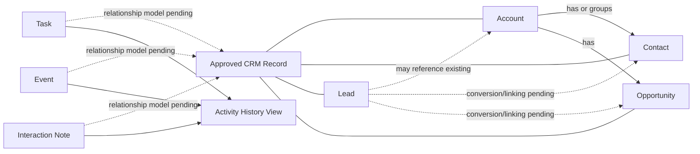

# Core Domain Model

**Status:** Draft business model; not a final database schema

## Confirmed domain meaning

- **Account:** an organisation or entity; not a bank account.
- **Contact:** a person, normally linked to an Account but potentially standalone.
- **Lead:** an early prospect that may refer to a new organisation or an existing Account.
- **Opportunity:** a specific potential sale with a stage and expected close date.
- **Task/Event:** follow-up or scheduled activities linked to CRM context.
- **Activity history:** a chronological view of interactions; it is not assumed to be a single database table.

## Design points still open

| Area | Decision required |
|---|---|
| Activities | One polymorphic relationship or entity-specific links. |
| Lead conversion | Records created/linked and transaction/rollback behaviour. |
| History | Which edits, notes and completed/cancelled activities remain visible. |
| Deletion | Hard delete versus archive/deactivate. |
| Extensions | Quotes, documents, users/roles and AI workflow records are outside the six-entity baseline until prioritised. |

Detailed fields and business rules remain in [requirements-and-scope.md](../product/requirements-and-scope.md).
