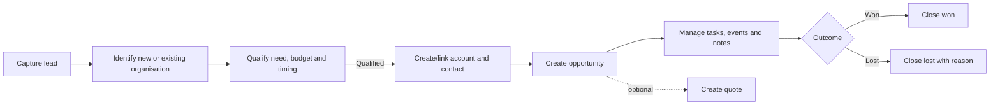
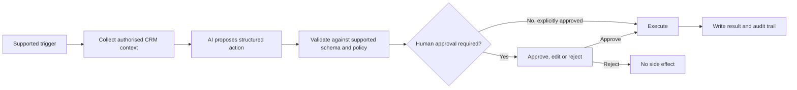

# Personas, Domain Glossary and Workflows

## Primary personas

### CRM user / sales user
Creates and maintains customers and prospects, records interactions, manages follow-up tasks and progresses opportunities.

### CRM administrator
Manages users, roles, workflow configuration, approved templates, data policy and system-level settings.

### Sales or service manager
Reviews pipeline and activities, identifies overdue work and may inspect audit/workflow outcomes.

### Service coordinator (reference-vertical persona)
Schedules field visits, considers location and job duration, and communicates planned visits to customers and technicians.

### Field technician or trainee (reference-vertical persona)
Reviews customer/site/instrument context before arriving and records the completed interaction.

## Glossary

| Term | Working definition | Status |
|---|---|---|
| Account | An organisation or entity the business deals with; may be a company, charity or sole-trader business. | Confirmed |
| Contact | An individual person; usually linked to an account but may stand alone. | Confirmed |
| Lead | An unqualified or developing potential customer/enquiry, possibly from a new or existing organisation. | Confirmed |
| Opportunity | A specific potential sale or piece of business. | Confirmed |
| Expected close date | The date on which an order or sale is expected to be secured/closed. | Confirmed |
| Task | A follow-up action with status, priority, due date, assignee and related CRM record. | Confirmed concept |
| Event | A scheduled interaction such as a meeting or visit with start/end and related CRM record. | Confirmed concept |
| Activity history | Chronological record of tasks, events, notes and relevant changes. | Confirmed desired behaviour |
| Workflow | A configured trigger/condition/action sequence that may include agent assistance and human approval. | Proposed detail |
| Agent | AI-enabled component that interprets context or proposes/executes supported workflow steps. | High-level objective; exact capabilities pending |

## Core sales workflow

## Core customer-interaction workflow

1. Find the account, contact or opportunity.
2. Review the connected record and recent activity history.
3. Add an interaction note and/or create a follow-up task.
4. Schedule an event when a meeting or visit is required.
5. Complete/cancel the activity while retaining its history.

## Proposed controlled AI workflow pattern

## Candidate first AI use cases

1. Summarise an account/contact/opportunity activity history.
2. Draft a follow-up task from a meeting note or opportunity state.
3. Draft a workflow definition from plain-language instructions.
4. Generate a customer notification draft from a scheduled event.

The first implementation should select **one** narrow use case with measurable acceptance criteria rather than attempting broad autonomous behaviour.
