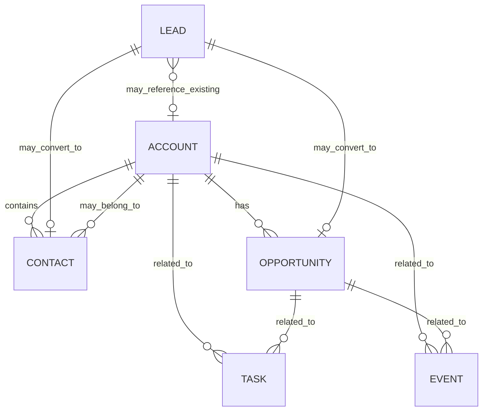

# Requirements and Scope Baseline

## Evidence labels

- **Confirmed:** directly stated in the project background or meeting transcript.
- **Proposed:** recommended to make the product coherent, safe or deliverable; requires review.
- **Pending:** alternatives were discussed but no decision was reached.

## Functional scope

### Must-have baseline

| Capability | Requirement | Evidence |
|---|---|---|
| Accounts | Create and maintain organisations/entities. | Confirmed |
| Contacts | Create and maintain people and link them to accounts when appropriate. | Confirmed |
| Leads | Capture potential people/organisations, including existing and new organisation cases. | Confirmed |
| Opportunities | Represent specific potential sales, stages and expected close date. | Confirmed |
| Tasks | Create, assign, prioritise and link follow-up work to CRM records. | Confirmed |
| Events | Schedule and link meetings/activities to CRM records. | Confirmed |
| Activity history | Retain notes and completed/planned interactions in context. | Confirmed desired behaviour; current gap |
| Lookup/search | Find and link accounts and other related records. | Confirmed through demonstration |
| Workflow agents | Set up and implement at least one controlled workflow through agent integration. | Confirmed objective; exact use case pending |
| IP-safe UI | Remove Salesforce branding/look-and-feel from the delivered implementation. | Proposed |
| Repository/process | GitHub, branches, Markdown memory, reviewable changes and documented requirements. | Proposed |

### Proposed operational baseline

| Capability | Rationale | Status |
|---|---|---|
| Authentication and role-based access | The client identified the absence of authentication/roles as unsuitable for a real CRM. | Confirm delivery phase |
| Audit log | Required to account for multi-user changes and AI actions. | Proposed |
| Synthetic demo data | Avoid using historical customer information in development/demo. | Proposed |
| Reproducible environment and CI | Reduce team integration and migration failures. | Proposed |
| Human approval for consequential AI actions | Prevent silent record changes, messages or commitments. | Proposed |
| AI data-handling policy | CRM data may be personal or commercially sensitive. | Proposed |
| Responsive interface | Mobile users and small-screen limitations were discussed. | Proposed |

### Extensions to prioritise separately

- Quote management linked to opportunities.
- Document attachments.
- Reports and exports.
- Customer/user notifications.
- Route/day-plan optimisation for field service.
- Cases and contracts.
- Enterprise organisational hierarchy.

## Explicit exclusions or deferrals

- Salesforce logos, copied visual design or other Salesforce IP.
- Proposals and solutions unless a specific workflow is approved.
- Full enterprise CRM parity.
- Large-scale/high-volume performance optimisation without evidence it is needed.
- A Go rewrite solely for novelty; it must win the architecture evaluation.
- Autonomous AI actions without agreed controls and auditability.

## Core relationship model

The exact polymorphic-activity implementation is an architecture decision. The diagram expresses the business relationship, not a final database schema.

## Draft business rules requiring confirmation

1. Account name is required; contacts may exist without an account.
2. A lead can refer to an existing account or a not-yet-created organisation.
3. Expected close date is required for active opportunities.
4. Lead and opportunity stage lists must be approved by the Product Owner.
5. Completed tasks, cancelled events and converted/disqualified leads remain historically visible.
6. Record deletion should normally be replaced by archive/deactivate behaviour.
7. AI-generated content is a draft unless the selected use case is explicitly approved for automatic execution.
8. Quotes are not part of the six-record initial brief and require an explicit prioritisation decision.

## Quality attributes

| Attribute | Initial requirement |
|---|---|
| Maintainability | Clear modules, documented setup, migrations, tests and ADRs. |
| Security | Authentication, server-side authorisation, secret management and least privilege before non-local use. |
| Privacy | Synthetic development data and an approved AI data boundary. |
| Reliability | Transactional handling for conversions/workflows and visible error states. |
| Usability | Coherent navigation, validated forms, useful lookup and contextual history. |
| Responsiveness | Core workflows usable on agreed laptop/tablet/mobile widths. |
| Observability | Logs and workflow-run status sufficient to diagnose failures without leaking sensitive data. |
| IP compliance | No Salesforce branding or copied interface assets. |
